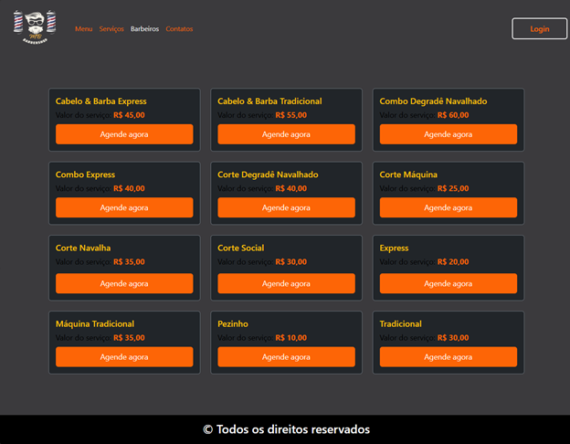
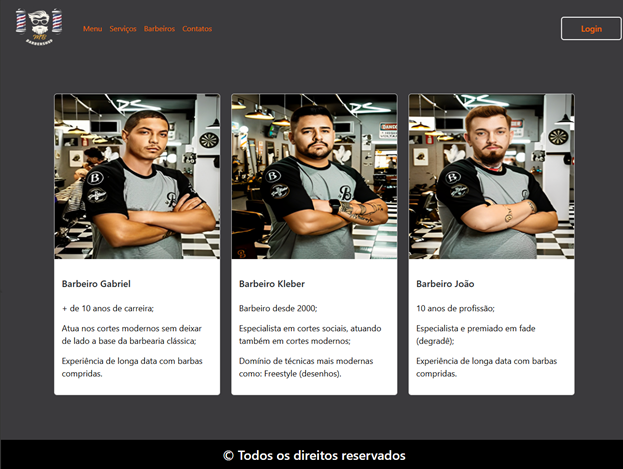
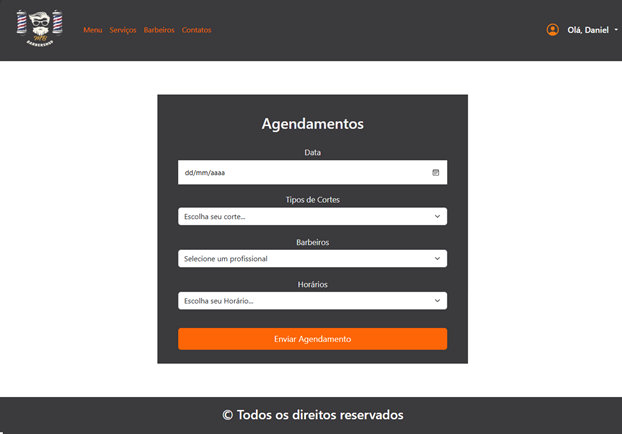
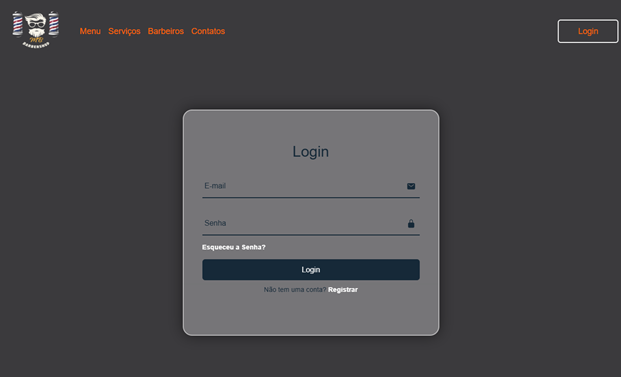
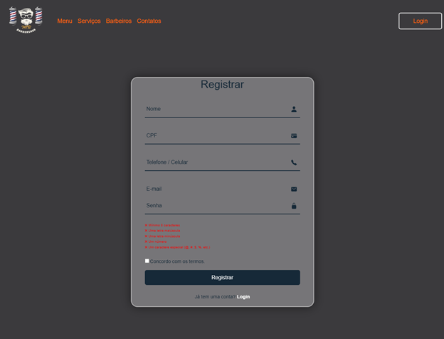
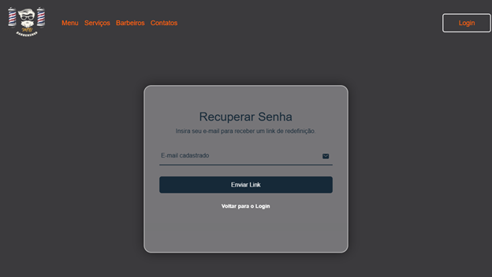
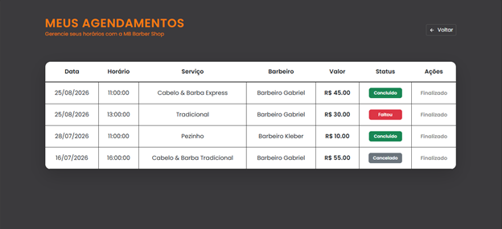
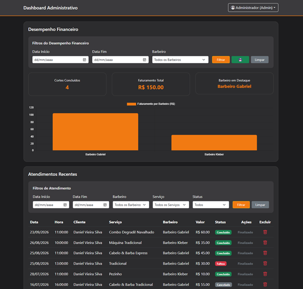

# 💈 MB BARBER SHOP

Sistema de gestão para barbearia desenvolvido como projeto acadêmico.

O MB Barber Shop foi desenvolvido com o objetivo de facilitar o gerenciamento
de uma barbearia, permitindo o controle de clientes, barbeiros, serviços,
agendamentos e informações administrativas.

> 📌 Este repositório apresenta a versão pública do projeto para fins de
> portfólio e demonstração. A implementação completa do back-end e do banco
> de dados não está disponibilizada publicamente.

---

## 📸 Demonstração

### 🏠 Página Inicial


### ✂️ Serviços



### 💈 Barbeiros



### 📅 Agendamento



### 🔐 Login



### 📝 Cadastro



### 🔑 Recuperação de Senha



### 📋 Meus Agendamentos



### 📊 Dashboard Administrativo



---

## 🚀 Funcionalidades

### 👤 Clientes

- Cadastro de clientes
- Login
- Validação de dados
- Recuperação de senha
- Visualização dos próprios agendamentos
- Cancelamento de agendamentos

### 📅 Agendamentos

- Escolha da data
- Escolha do serviço
- Escolha do barbeiro
- Escolha do horário
- Consulta de horários disponíveis
- Controle do status do agendamento

### 💈 Barbeiros

- Cadastro de barbeiros
- Gerenciamento da equipe
- Controle de status dos profissionais
- Visualização dos barbeiros disponíveis

### ✂️ Serviços

- Cadastro de serviços
- Visualização dos serviços disponíveis
- Alteração de valores
- Gerenciamento dos serviços

### 📊 Administração

- Dashboard administrativo
- Visualização de atendimentos
- Controle financeiro
- Gerenciamento de barbeiros
- Bloqueio de horários
- Registro de atividades do sistema
- Controle de status dos agendamentos

---

## 🛠️ Tecnologias utilizadas

### Front-end

- HTML5
- CSS3
- JavaScript

### Back-end

- Node.js
- Express.js

### Banco de dados

- MySQL

### Outras tecnologias

- Nodemailer
- dotenv
- CORS
- Body Parser

---

## 📁 Estrutura do projeto

```text
MB-BARBER-SHOP/
│
├── CSS/
├── HTML/
├── IMAGEM/
├── JS/
├── .gitignore
├── package.json
├── package-lock.json
└── README.md
